<!-- Generated by generator/build.py. Edit profile.yml instead. -->


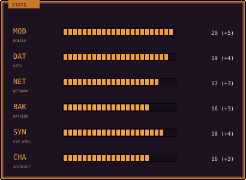
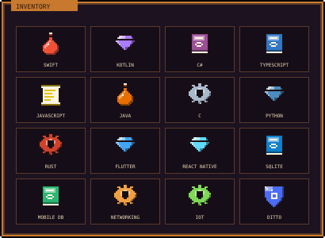

<a href="https://github.com/biozal/ditto-edge-studio">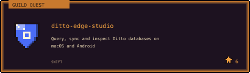</a>
<a href="https://github.com/ditto-examples/ditto-whiteboard-datastreams">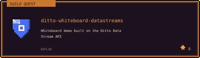</a>

<a href="https://github.com/ditto-examples/demoapp-retail">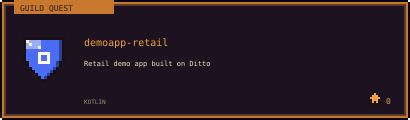</a>
<a href="https://github.com/biozal/cartyx-app">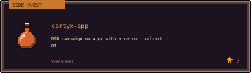</a>

<a href="https://github.com/biozal/cartyx-sim">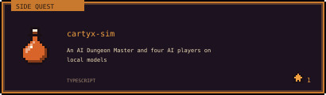</a>
<a href="https://github.com/biozal/ttrpg-sfx">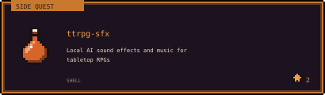</a>

<a href="https://dev.to/biozal/running-android-vms-on-arm-rebuilding-the-minisforum-ms-r1-kernel-for-cuttlefish-52a1">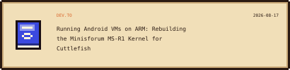</a>
<a href="https://dev.to/biozal/migrating-a-real-app-to-swift-6-data-races-a-dependency-i-had-to-evict-and-the-compiler-that-15cm">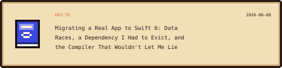</a>

<a href="https://dev.to/biozal/porting-a-swiftui-app-to-avalonia-how-does-cross-platform-net-hold-up-4ol0">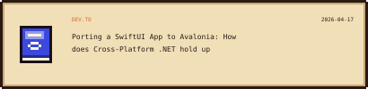</a>
<a href="https://www.youtube.com/channel/UCXgF-JqwBRGSawXajr6plGg">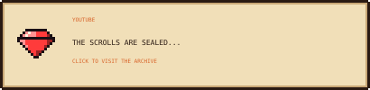</a>

<picture>
  <source media="(prefers-color-scheme: dark)" srcset="https://raw.githubusercontent.com/biozal/biozal/output/pacman-contribution-graph-dark.svg">
  <source media="(prefers-color-scheme: light)" srcset="https://raw.githubusercontent.com/biozal/biozal/output/pacman-contribution-graph.svg">
  
</picture>

